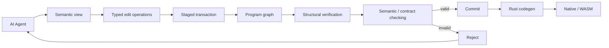

# Alva

> **Repository visibility: PUBLIC.** This is the public implementation
> snapshot for Alva: compiler, AEP, examples, tests, and public design
> documentation. Public research evidence is maintained separately in
> [`zkidp/alva-research`](https://github.com/zkidp/alva-research). Manuscript
> sources, raw private artifacts, author provenance, and submission staging do
> not belong in this repository.

**What if AI agents stopped editing source code?**

Alva is an experimental programming system designed around AI agents as the primary program authors.

Instead of requiring agents to mutate source text directly, Alva provides a typed, content-addressed program representation and a transactional, semantically verified editing interface.

Alva currently compiles to Rust and targets native binaries and WASM/WASI.

**Status: active research prototype.** The system works, but the design is still evolving.

## Why?

Today's coding agents operate on a representation designed primarily for humans:

read files → reason about text → generate a patch → parse → type-check → discover errors → patch again

This works surprisingly well, but it means an agent must repeatedly reconstruct program structure from text, preserve syntax it does not semantically care about, and discover many invalid edits only after applying them.

Alva explores a different model:



The authoritative state does not have to be hand-written source text.

## The core idea

### The program representation

The authoritative program representation is a typed, content-addressed graph:

- stable named entities
- content-addressed revisions
- immutable path-copy updates
- typed node schemas
- deterministic serialization
- explicit dependency structure
- integrity verification
- cycle and dangling-reference detection
- crash-safe generations
- source text is only a projection/import format when graph authority is enabled

### The edit protocol

Agents modify programs through structured, transactional operations instead of arbitrary text patches:

`inspect_entity` · `create_node` · `create_hole` · `replace_node` · `replace_slot` · `append_child` · `bind_symbol` · `rename_symbol` · `delete_entity` · `check` · `commit` · `abort`

Mutations are staged. A failed operation cannot partially corrupt the authoritative program, and a commit must pass both structural verification and the real semantic checker.

### Agent views

An agent should not need to load an entire repository to modify one function:

```text
alva view module ...
alva view function ...
alva view dependencies ...
alva view callers ...
alva view impact ...
```

Typed holes expose candidates based on lexical scope and expected type:

```text
alva hole inspect ...
alva hole candidates ...
alva hole fill ...
```

## What works today

- `.alva` → semantic checking → Rust code generation
- native compilation and WASM/WASI target
- records, enums, exhaustive match, vectors, maps, `result<T, E>` errors
- contracts (pre, post, inv), property tests, first-class benchmarks
- typed Rust FFI
- structured machine-readable diagnostics
- parser/resource limits with stable error codes
- typed program graphs: content-addressed revisions, authoritative storage, crash-safe generations
- transactional structured edits
- typed holes with lexical-scope-aware candidate generation
- semantic diff
- dependency / caller / impact views
- stale-revision conflict detection
- cross-process commit locking
- adversarial validation and fuzz testing

## 30-second quickstart

Requirements: Rust toolchain and Cargo.

```bash
cd alva
cargo build --release
```

Linux / macOS:

```bash
./target/release/alva check examples/hello.alva
./target/release/alva run examples/hello.alva
```

Windows:

```powershell
.\target\release\alva.exe check examples\hello.alva
.\target\release\alva.exe run examples\hello.alva
```

Expected output:

```text
hello, ai-native world
```

A minimal Alva program currently looks like this:

```scheme
(module
  (name "hello")
  (version "0.1.0")
  (cap io)
  (export main)

  (fn main
    (params)
    (returns (result (prim nil) (prim string)))
    (eff io)
    (body
      (call io.print (string "hello, ai-native world"))
      (nil))))
```

## A real validation project: an S3-style object store

The repository contains a working object-storage server written through the Alva toolchain:

- PUT / GET / DELETE / HEAD
- bucket creation and deletion
- object listing
- S3-style XML responses
- SigV4 authentication
- persistent content-addressed blobs
- atomic metadata commits
- crash recovery
- path traversal protection
- structured storage error codes
- checksum support
- deduplication
- garbage collection

rclone interoperability has been tested, including nested paths and an 85 MB byte-identical upload/download round trip.

The object store is intentionally used as a vertical-slice stress test: Alva should have to support a non-trivial system, not only toy examples.

See [alva/README.md](alva/README.md) for the current implementation details and command reference.

## Design principles

1. **Verifiability over textual convenience** — reject structurally invalid states as early as possible.
2. **Semantic locality** — inspect function, dependencies, callers, expected types, and impact without rereading an entire repository.
3. **Transactions over best-effort patches** — a failed edit leaves authoritative program state unchanged.
4. **Stable identities over line numbers** — program entities survive unrelated textual movement.
5. **Machine-readable diagnostics** — errors are data an agent can reason about, not prose it must reinterpret.
6. **Measure instead of assume** — structured editing should earn its place with evidence, not by assumption.

## What Alva is not claiming

- the system has already solved agentic programming
- Alva is ready to replace Rust, C++, Python, or existing application languages
- the S3 implementation is equivalent to MinIO or production cloud object storage
- source text is useless
- typed graphs, contracts, content addressing, or transactions are individually novel ideas

The research question is about what happens when these ideas become the authoritative interface between an AI coding agent and a program.

## Repository map

```text
alva/
  compiler, CLI, runtime and examples
tests/
  language, graph and storage test suites
examples/store_split/
  S3-style object store (multi-module)
examples/build_system/
  incremental build system (multi-module, B1-B11 acceptance)
v0.8-EVIDENCE-BACKLOG.md
  evidence-backed v0.8 language/agent backlog (from three workloads)
设计方案.md
  architecture and design notes
语法草案.md
  language grammar and implementation notes
```

Useful starting points:

- [alva/README.md](alva/README.md) — toolchain and command reference
- [设计方案.md](设计方案.md) — architecture / roadmap
- [语法草案.md](语法草案.md) — grammar notes

## Roadmap

- **Agent operations**: reduce expensive expression restructuring, improve operation granularity, reduce protocol/tool-call overhead
- **Language and compiler**: ownership / resource model, stronger static verification, native backend exploration
- **Agent runtime**: better semantic views, planning and impact analysis, efficient structured-edit workflows
- **Self-hosting**: eventually compile more of Alva using Alva itself

## Validation workloads

Two full multi-module systems are shipped as examples:

- `examples/store_split/` - an S3-style object store (PUT/GET/DELETE/HEAD,
  SigV4, persistent blobs, atomic metadata commits, crash recovery, GC;
  rclone-interoperable, 85 MB byte-identical round trip).
- `examples/build_system/` - an incremental build graph (content-based cache,
  deterministic topo order, reverse invalidation, persistence/restart,
  crash-safe promote, B1-B11 acceptance suite).

`v0.8-EVIDENCE-BACKLOG.md` records which language/agent-interface gaps these
workloads evidence, and separates confirmed language gaps from compiler
correctness bugs and agent-interface hypotheses.

Issues, experiments, counterexamples, and critical feedback are welcome.

## License

Apache-2.0
