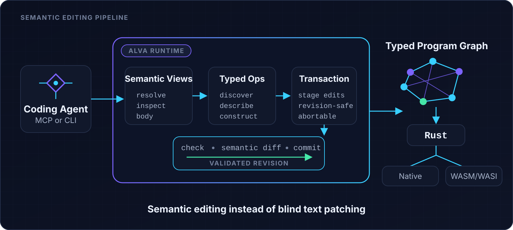
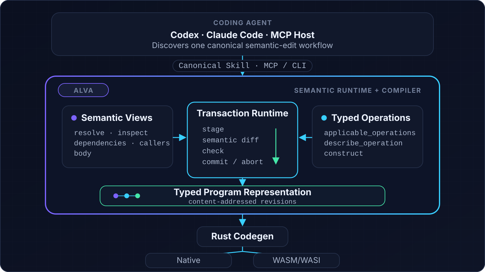

# ALVA

**A compiler and semantic editing runtime for AI coding agents.**

ALVA lets agents inspect and change programs through typed semantic operations
instead of blind source-text patching. Edits are staged, checked, reviewed as a
semantic diff, and committed transactionally. Valid programs compile to Rust
for native or WASM/WASI targets.

[](https://github.com/zkidp/alva-core/releases/tag/v0.14.1-preview.2)
[](https://github.com/zkidp/alva-core/actions/workflows/ci.yml)
[](LICENSE)

[Quickstart](#quickstart) · [MCP](#connect-through-mcp) ·
[Codex](integrations/codex/README.md) ·
[Claude Code](integrations/claude-code/README.md) ·
[Releases](https://github.com/zkidp/alva-core/releases)

<p align="center">
  
</p>

## Quickstart

The current Developer Preview is **`v0.14.1-preview.2`**. The installers
download the matching release archive and verify it against
`SHA256SUMS.txt`.

### Windows x64

```powershell
irm https://raw.githubusercontent.com/zkidp/alva-core/main/scripts/install.ps1 | iex
alva --version
alva doctor
irm https://raw.githubusercontent.com/zkidp/alva-core/v0.14.1-preview.2/alva/examples/hello.alva -OutFile hello.alva
alva check hello.alva
```

### Linux x64

```bash
curl -fsSL https://raw.githubusercontent.com/zkidp/alva-core/main/scripts/install.sh | sh
export PATH="$HOME/.local/bin:$PATH"
alva --version
alva doctor
curl -fsSLO https://raw.githubusercontent.com/zkidp/alva-core/v0.14.1-preview.2/alva/examples/hello.alva
alva check hello.alva
```

### macOS Apple Silicon

```bash
curl -fsSL https://raw.githubusercontent.com/zkidp/alva-core/main/scripts/install.sh | sh
export PATH="$HOME/.local/bin:$PATH"
alva --version
alva doctor
curl -fsSLO https://raw.githubusercontent.com/zkidp/alva-core/v0.14.1-preview.2/alva/examples/hello.alva
alva check hello.alva
```

The prebuilt binary is sufficient for checking, semantic editing, semantic
views, typed construction, and graph inspection. `alva build` and `alva run`
generate and compile Rust, so they also require Rust and Cargo. For WASM/WASI:

```bash
rustup target add wasm32-wasip1
```

Run `alva doctor` at any time to inspect the installed and optional toolchain
components. Release archives and checksums are available on
[GitHub Releases](https://github.com/zkidp/alva-core/releases).

## Why semantic editing?

Most coding agents work through a text loop:

```text
read files → infer structure → patch text → parse → type-check → repair
```

ALVA exposes program structure directly:

```text
resolve → inspect → discover operations → stage → diff → check → commit
```

The second workflow gives an agent typed operation schemas, stable entity and
revision identities, narrow semantic views, structured diagnostics, and an
explicit transaction boundary. Invalid work can be rejected or aborted without
partially changing the authoritative program.

**What if AI agents stopped editing source code?** ALVA explores that question
by making semantic operations—not line-oriented patches—the primary editing
interface.

## What ALVA provides

| Area | Current capability |
| --- | --- |
| Compiler | `.alva` parsing and semantic checking, Rust code generation, native builds, and WASM/WASI output |
| Language | Records, enums, exhaustive match, vectors, maps, `result<T, E>`, contracts, property tests, benchmarks, and typed Rust FFI |
| Semantic runtime | Content-addressed program revisions, transactional edits, stale-revision detection, structural verification, crash-safe generations, and cross-process commit locking |
| Agent interface | Entity, dependency, caller, and body views; typed operation discovery and construction; semantic diff; structured diagnostics |
| Integrations | Local STDIO MCP server, canonical agent Skill, and thin Codex and Claude Code plugin packages |

## A semantic edit in one transaction

An MCP-capable agent uses the tool schemas returned by the installed ALVA
binary. A typical edit follows this sequence:

```text
begin_transaction(alva.toml)
  → resolve_entity
  → inspect_body
  → applicable_operations
  → describe_operation / describe_construction
  → stage the smallest typed mutation
  → preview_semantic_diff
  → check_transaction
  → commit_transaction  # or abort_transaction
```

Every call after `begin_transaction` carries its explicit `transaction_id`.
The agent discovers valid operations and their arguments at runtime instead of
relying on a second, hand-maintained command schema. See the
[canonical ALVA Skill](integrations/skills/alva/SKILL.md) for the complete
MCP-first, CLI-fallback workflow.

## Connect through MCP

The installed `alva` binary includes a local STDIO MCP server:

```text
alva mcp
```

Configure an MCP host with command `alva` and arguments `["mcp"]`. The server
uses the same AEP operation registry and AIR transaction implementation as the
CLI, so the transport does not create a second semantic interface.

Claude Code can register it directly:

```bash
claude mcp add --transport stdio alva -- alva mcp
```

For protocol details and host configuration, see the
[MCP guide](integrations/mcp/README.md).

## Coding-agent integrations

Both packages reuse the same canonical Skill and start the independently
installed `alva mcp` server. They do not fork the editing workflow or bundle a
separate compiler.

| Host | Install from a repository clone | Guide |
| --- | --- | --- |
| Codex | `codex plugin marketplace add integrations/codex`<br>`codex plugin add alva@alva` | [Codex integration](integrations/codex/README.md) |
| Claude Code | `claude plugin marketplace add ./integrations/claude-code`<br>`claude plugin install alva@alva` | [Claude Code integration](integrations/claude-code/README.md) |

Install ALVA first and ensure `alva doctor` succeeds in the environment
inherited by the coding-agent host.

## Real examples

The repository includes two multi-module systems that exercise the toolchain
beyond small language samples:

- [`examples/store_split/`](examples/store_split/) implements an S3-style
  object store with PUT, GET, DELETE, HEAD, SigV4 authentication, persistent
  content-addressed blobs, atomic metadata commits, crash recovery, checksums,
  deduplication, and garbage collection.
- [`examples/build_system/`](examples/build_system/) implements an incremental
  build graph with content-based caching, deterministic topological ordering,
  reverse invalidation, persistence, restart, and crash-safe promotion.

Smaller programs are available under [`alva/examples/`](alva/examples/).

## How it works

<p align="center">
  
</p>

ALVA stores authoritative programs as typed, content-addressed graphs with
stable named entities, immutable path-copy updates, explicit dependencies, and
deterministic serialization. Source text remains useful as an import and
projection format; semantic operations provide the controlled mutation path
when graph authority is enabled.

## Developer Preview status

ALVA is an active Developer Preview, not a production-ready toolchain. The
compiler, semantic runtime, MCP server, and integrations are usable today, but
APIs, operation schemas, and storage formats may change between preview
releases. Pin a release when reproducibility matters.

The project does not claim to replace established application languages or
that semantic editing eliminates every need for source text. It provides a
concrete system for building and evaluating an agent-oriented programming
workflow.

## Build from source

Requirements: a Rust toolchain and Cargo.

```bash
git clone https://github.com/zkidp/alva-core.git
cd alva-core/alva
cargo build --release
./target/release/alva --version
./target/release/alva check examples/hello.alva
./target/release/alva run examples/hello.alva
```

Expected output:

```text
hello, ai-native world
```

## Contributing

Issues, focused pull requests, examples, and critical feedback are welcome.
See [`AGENTS.md`](AGENTS.md) for the repository map, public boundary, and checks
expected before a change is committed.

## License

ALVA is licensed under the [Apache License 2.0](LICENSE).
